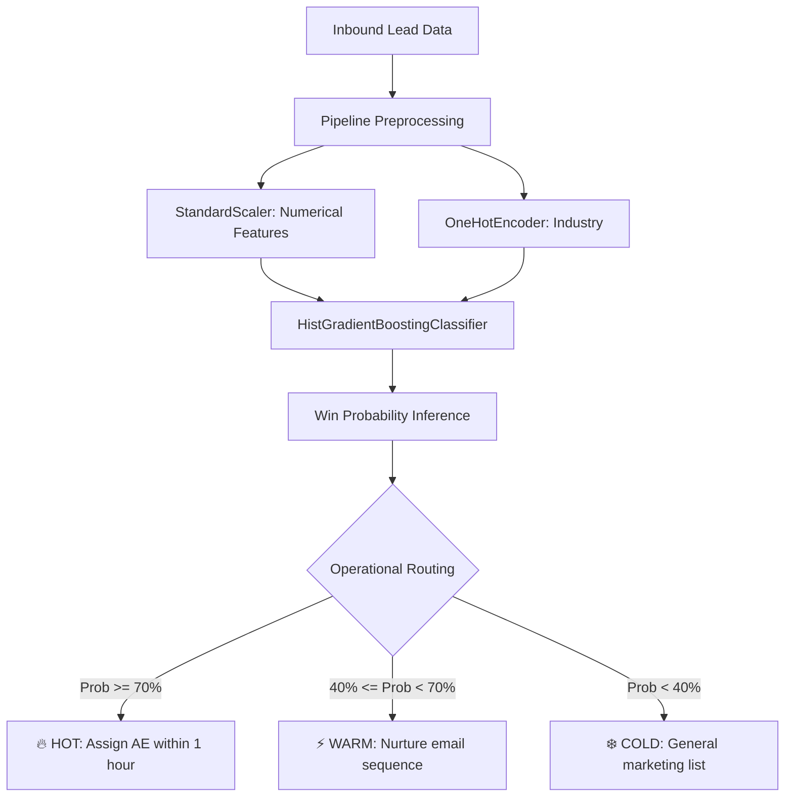

# 🎯 CRM — ML Lead Scoring & Operational Prioritization

[](https://www.python.org/)
[](https://scikit-learn.org/)
[](https://pandas.pydata.org/)
[](LICENSE)

An end-to-end Machine Learning pipeline for B2B sales lead qualification and scoring. It evaluates customer firmographics, online engagement metrics, and sales cycle timing to compute conversion probabilities and route qualified leads to the sales team.

---

## 🎯 Business Problem

In B2B sales, account executives often waste substantial time chasing unqualified prospects while high-value inbound leads turn cold.

This tool solves that inefficiency by:
- Automated feature preprocessing for mixed categorical and numerical data.
- Calculating a calibrated **Win Probability (0–100%)** for each inbound prospect.
- Segmenting accounts into immediate SLA action tiers (HOT, WARM, COLD).

---

## 🏗️ Architecture & ML Pipeline



---

## 📊 Features & Lead Attributes

- **Firmographics**: Company size (`company_size`), Industry vertical (`industry`).
- **Digital Engagement**: 30-day website visits (`site_visits_last_30d`), Content downloads (`whitepaper_downloads`), Marketing email engagement (`email_click_rate`).
- **Pipeline Dynamics**: Time active in current pipeline stage (`days_in_pipeline`).

---

## 📦 Requirements

- Python 3.8+
- `numpy`
- `pandas`
- `scikit-learn`

Install dependencies:
```bash
pip install numpy pandas scikit-learn
```

---

## 🚀 Quick Start & Usage

```bash
git clone https://github.com/duttbhavsar28-cpu/Crm-.git
cd Crm-
python crm.py
```

### Execution Output

```text
=== INBOUND LEAD CONVERSION SCORES ===
  lead_id      lead_name  win_probability_pct                    sales_action
 LEAD-901      Acro Corp                 88.4  HOT (Assign AE within 1 hour)
 LEAD-902  BioGenix Labs                 52.1        WARM (Nurture sequence)
 LEAD-903    Solo Studio                 12.3     COLD (Automated email only)
```

---

## 🗣️ 30-Second Interview Pitch

> *"I built an intelligent CRM lead qualification module that predicts customer win probability using a gradient-boosted classification pipeline with categorical encoding and scaling. It segments prospects into HOT, WARM, and COLD action tiers, enabling sales reps to respond to top-converting accounts within 1 hour, shortening sales cycles and accelerating ARR."*

---

## 📄 License

Distributed under the MIT License.
